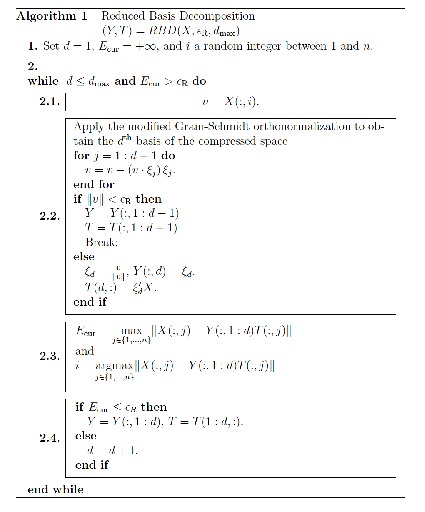
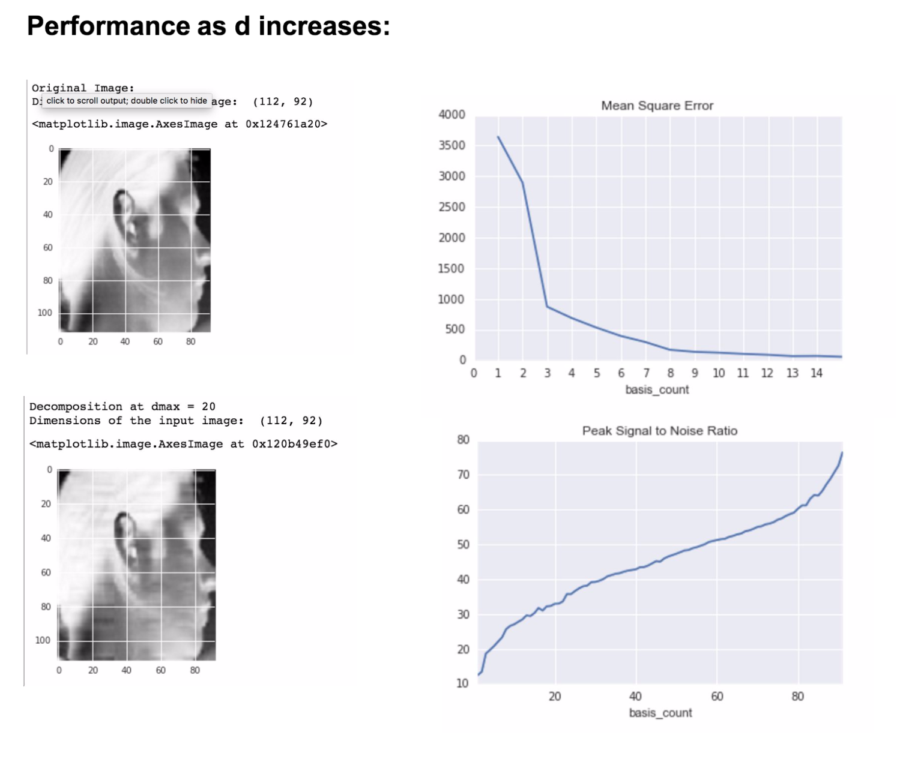

===========================
Reduced Basis Decomposition
===========================

.. image:: https://img.shields.io/pypi/v/reduced_basis_decomposition.svg
        :target: https://pypi.python.org/pypi/reduced_basis_decomposition

.. image:: https://img.shields.io/travis/AAbercrombie0492/reduced_basis_decomposition.svg
        :target: https://travis-ci.org/AAbercrombie0492/reduced_basis_decomposition

.. image:: https://readthedocs.org/projects/reduced-basis-decomposition/badge/?version=latest
        :target: https://reduced-basis-decomposition.readthedocs.io/en/latest/?badge=latest
        :alt: Documentation Status

.. image:: https://pyup.io/repos/github/AAbercrombie0492/reduced_basis_decomposition/shield.svg
     :target: https://pyup.io/repos/github/AAbercrombie0492/reduced_basis_decomposition/
     :alt: Updates

Python package for reduced basis decomposition algorithm concieved by Yanlai Chen.

* Free software: MIT license
* Documentation: https://reduced-basis-decomposition.readthedocs.io.

About Reduced Basis Decomposition
--------
Dimensionality reduction is a widely used technique in compression and feature engineering.
Numerical methods such as SVD and PCA are classic dimensionality reduction techniques.
SVD and PCA can create adequate approximations of data
with a minimal number basis vectors. SVD computes all of the eigenvalues and eigenvectors of
matrix in order of primary importance. In the case of image compression, a basis vector count of
40% of the original image can constitute a compression that is indistinguishable to the human
eye.

If so few basis vectors are needed to produce an adequate image compression, why compute a
full set of eigenvalues and vectors with SVD? Reduced basis decomposition (RBD) can substitute SVD
and outperform it in cases where an engineer wants to limit compression size.
RBD is a greedy lossy algorithm that uses the modified Gramm-Schmidt process to build a lean
set of optimized basis vectors. Its virtues are its speed and efficiency in the early stages of a
decomposition.

Pseudocode
--------
*Y,T = RBD(X, Error_Requirement, Max_Basis)*

While the Error_Requirement and Max_Basis conditions are unmet:

1. Pick a vector from X with the optimal error correction power to orthogonally
project onto the Y space.

2. Add the vector to Y using the Gramm-Schmidt process. Add the dot product of the
transpose of the vector and X to T, enabling future reconstruction.

3. Check to make sure the newest column

Algorithm
--------

Performance over number of basis (d)
--------

References
--------
Submitting to pypi
- http://peterdowns.com/posts/first-time-with-pypi.html

Cookie Cutter PyPackage Tutorial
- https://cookiecutter-pypackage.readthedocs.io/en/latest/tutorial.html#step-2-generate-your-package

* TODO

Credits
---------

Algorithm formulated by Yanlai Chen.
- https://arxiv.org/abs/1503.05947

This package was created with Cookiecutter_ and the `audreyr/cookiecutter-pypackage`_ project template.

.. _Cookiecutter: https://github.com/audreyr/cookiecutter
.. _`audreyr/cookiecutter-pypackage`: https://github.com/audreyr/cookiecutter-pypackage
